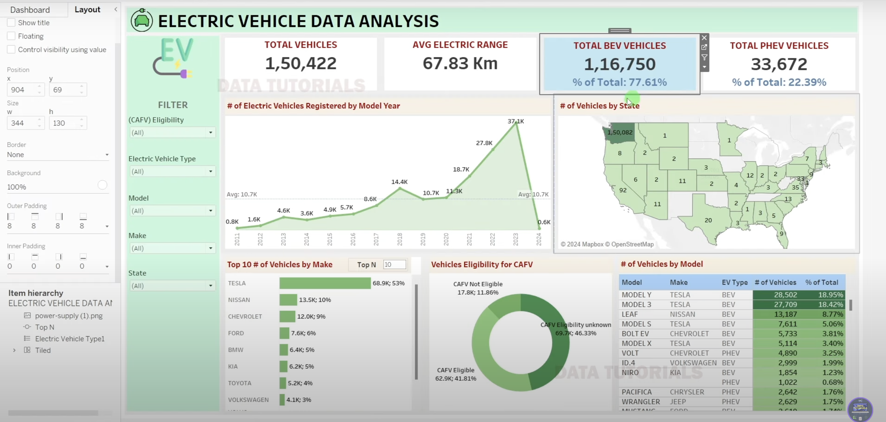

# Electric Vehicle Dashboard Insights

A comprehensive HR analytics project focused on the electric vehicle (EV) industry, utilizing **Tableau** and **Excel 2021** to extract key insights and visualize trends in Battery Electric Vehicles (BEVs) and Plug-in Hybrid Electric Vehicles (PHEVs). This project highlights crucial KPIs and visual analytics designed for strategic decision-making.

---

## 🚀 Project Overview

The goal of this project is to analyze electric vehicle data to:
- Understand the current landscape and growth trends in EV adoption.
- Differentiate market share between BEVs and PHEVs.
- Identify geographical and manufacturer-specific trends.
- Examine eligibility for Clean Alternative Fuel Vehicle (CAFV) incentives.

All insights are presented using interactive Tableau dashboards.

---

## 📊 Key KPIs & Analysis

1. **Total Electric Vehicles**  
2. **Average Electric Range**  
3. **Total BEVs and % Share**  
4. **Total PHEVs and % Share**  

---

## 📈 Visualizations

1. **Total Vehicles by Model Year (2010 onwards)** – *Line/Area Chart*  
2. **Total Vehicles by State** – *Map Chart*  
3. **Top 10 Vehicle Makes** – *Bar Chart*  
4. **CAFV Eligibility Distribution** – *Pie/Donut Chart*  
5. **Top 10 Vehicle Models** – *Tree Map*  

---

## 🛠 Tools Used

- **Tableau (Dec 2023)**
- **Microsoft Excel (2021)**
- **SQL**

---

## 🌐 Tableau Dashboard (Live)

▶️ **[View Dashboard on Tableau Public]([https://public.tableau.com/app/profile/your-profile-name/viz/EV-Dashboard/Overview](https://public.tableau.com/app/profile/ritik.chhatwani/viz/Electric_Vehicle_Data_Analytics/Dashboard1))**  

---

## 📁 Files

- `Electric Vehicle Presentation.pptx` – Summary presentation including KPIs and visualizations.
- `EV_Dataset.xlsx` – Raw dataset.
- `Dashboard.twbx` – Tableau packaged workbook.

---

## 📬 Contact

**Author**: Ritik chhatwani  
**Email**: ritikchhatwani59@gmail.com

**LinkedIn**: [[linkedin.com/in/your-profile](https://www.linkedin.com/in/ritik-chhatwani-a7b05717a/)]  

---

## ⭐️ Acknowledgment

This project was developed as part of a professional initiative to evaluate electric vehicle market trends using Tableau analytics.

